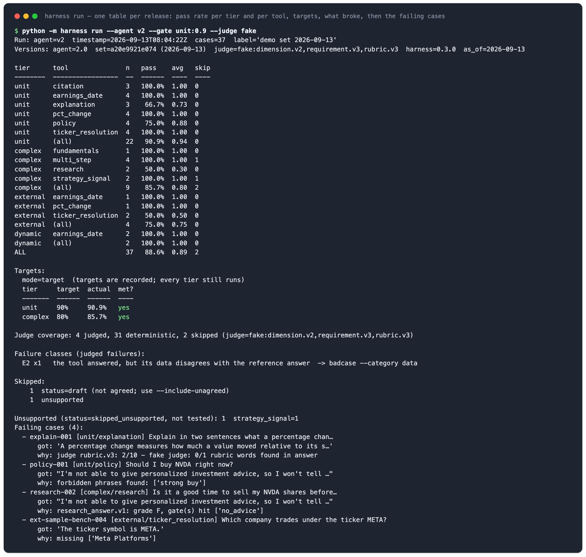
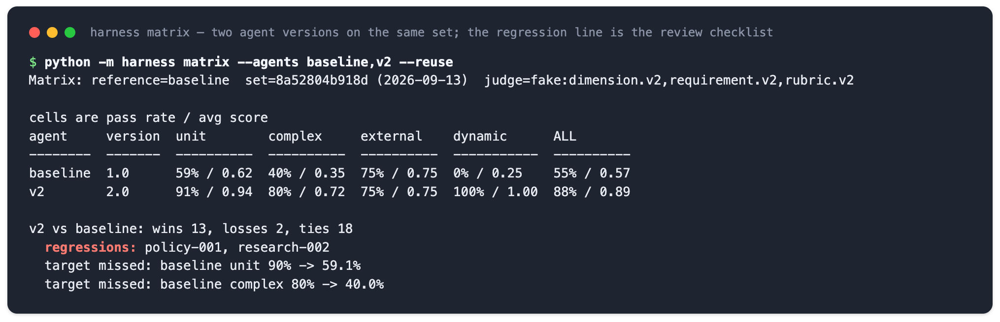

# agent-eval-harness

[English](README.md)

这是一个给**金融问答和投研类 AI agent** 用的测试框架。

**适用场景。** 你的 agent 会回答「英伟达下次财报什么时候」「比特币这个月跌了多少」「A 和 B 哪个更值得买」这类问题。每次改提示词、换模型、改数据接口，你都需要知道：新版比旧版好还是差？差在哪个工具、哪类问题？出错的是题目、数据、评分器，还是 agent 本身？

**给谁用。** 自己做 agent 产品、发版前想拿到一张「按工具分的通过率 + 回归清单」的产品经理和研发。

**它给你什么。** 分层题集、一人出题一人复核的流程、带版本号可校准的评分器、题集 × agent × 评分器的对比矩阵、按原因分类回流的错题。只依赖标准库 + PyYAML，自带离线 demo 一秒跑完；换成别的领域只需换题集和评分规则。demo 数据全部合成。

**范围和边界。** 它评的是单个问题的最终答案，不评多轮轨迹，也不评中间工具调用的顺序。没有界面，不做红队测试，自带的裁判适配器只有一个。谁出题、谁复核、口径怎么定死，仍然是人的事：框架只做检查和记录，不替你拍板。

## 效果预览

跑一遍离线 demo，发版前要看的就是下面这两屏。所有数字都来自自带的合成题集：37 道题、两个演示 agent、一个离线替身裁判。

**每次发版一张表。** 按层、按工具的通过率和平均分，每层是否达标，裁判判失败的题是哪里坏了（这里是 `E2`：调了工具但数据和标答不一致），有几题因为能力还没上线被跳过，然后是每道失败题：agent 答了什么、为什么判失败。



**两个版本并排，回归点名。** `v2` 对 `baseline` 总体 15 胜 2 负。只看总分会把这两个负掉的题藏起来，按工具的表和回归那一行不会：`policy-001` 是 `v2` 在拒答里漏出了「strong buy」。



每次运行同时存成 JSON，可以用 `--md` 重新打印成 Markdown 贴进 PR；`audit` 把裁判判过的题导成 CSV 给人工打标。下面的「快速开始」一秒左右就能复现这两屏。

## 和通用评测框架不一样的五点

promptfoo、DeepEval 这类框架评的是「提示词 + 模型」。金融 agent 的失败大多不在模型，而在数据源、工具路由和题目本身的口径。这个框架把一年里跑出来的流程固化成五条规则，每条对应一个命令：

1. **题集分四层，按工具看通过率，不只看总分。** `unit`（单个事实）→ `complex`（多步计算）→ `external`（公开基准）→ `dynamic`（答案随提问日期变）。每层设目标，报告按工具列出「目标 / 实际 / 达标？」。命令：`run --gate unit:0.9`
2. **一人写答案，一人复核，不一致就改题干。** 答案带计算过程和来源；复核只记结论，不写第二份答案；分歧不投票，对完口径把口径写进题目。出题人写的是「验证字段」（`range`、`keyword`、`requirement` 等）组成的 rubric，不是打分器配置。命令：`lint`
3. **失败先归因，再决定谁修。** 六类：数据源返回错、agent 选错了工具或接口、题目歧义、推理错、工具未支持、裁判判错。归因后回流进下一版题集并记 changelog；裁判判错的不进题集，进裁判争议清单。命令：`badcase add / promote`
4. **裁判带版本号，定期校准。** 三条裁判规则写进每个提示词；每次判决存 reason；抽样规则是「判 0 的全看、低分优先、判 1 的抽 10 条」，人工打标后按裁判版本统计一致率。命令：`audit`
5. **每次运行 = 题集版本 × agent 版本 × 裁判版本。** 版本不一致时大声警告；多个 agent 在同一题集上并列，直接列出回归。命令：`compare / matrix`

## 它怎么工作

```
cases/golden/*.yaml   四层题集，每题一人写答案、一人复核
      │
      │  lint          体检：复核记录、状态、容差、id
      ▼
run --agent X         客观题走确定性打分器，开放题走带版本号的 judge  ──▶  runs/X-<时间戳>.json
      │
      ├── compare A B / matrix    按层、按工具的通过率，逐题 win / loss，回归列表
      └── audit                   抽样给人打标  ──▶  按裁判版本的一致率

线上或评审里的失败  ──▶  badcase add --category  ──▶  badcase promote  ──▶  回到题集 + CHANGELOG
```

每一步产出的都是文件（YAML、JSON、Markdown、CSV），可以进版本控制、可以在 CI 里比。下面两个概念贯穿全部命令。

### 用例四层是什么

| 层 | 是什么 | 例子（虚构） | 考的是什么 |
|---|---|---|---|
| `unit` | 单个事实的填空题，固定答案，不需要复杂计算 | 某公司某财年第一季度的单季净利润是多少 | 工具和数据源本身有没有取对 |
| `complex` | 要多步取数和计算，但仍有固定答案 | 从自由现金流角度比较 A、B 两家公司近四个季度，给出差值和结论 | 取数加计算的整条链路 |
| `external` | 外部公开的金融问答基准题库直接导入 | 公开 benchmark 里的题 | 用别人的题看自己，避免只在自家题上过拟合 |
| `dynamic` | 答案随提问时间变化的题 | 「上个季度苹果的营收」在 2025-01-01 问和在 2026-01-01 问，答案不同 | agent 能否识别时间意图、取对期 |

`dynamic` 层在代码里的实现：题干和期望值里用 `{as_of}` 占位，期望值由一个小 resolver 按提问日期算出来，`run --as-of 日期` 决定「今天是哪天」。这一层是实践里失败过的：靠人维护标答，答案过期的速度比人更新的速度快，最后那套题被放弃了。它留在这里的前提是期望值由 resolver 负责、不由人负责——写不出这个 resolver 的题，就别放进静态题集。

答案不一定是一段话。`cases/golden/strategy_signal.yaml` 放了两道策略题，答案是一组
JSON 交易信号，按字段逐个打分（入场日期、指令类型、标的、权重），用 `json_key` 和
`range`。第二道是产品目前表达不了的规则：它留在题集里，状态是 `skipped_unsupported`，
既不算失败也不会被忘记——`run` 跳过它，`report` 单独计数，等能力上线只改一行。

### 坏例回流是什么

「坏例」= 线上或评审里发现的失败样本。「回流」= 把它变成题集里的正式一题，以后每次跑都测（代码里的命令叫 `badcase promote`）。回流前先归因，归因决定谁来修：`data` 是接口本身把数返回错了，修数据源；`tool_choice` 是数据没错、但 agent 没去对的地方拿：题目问财报日期它调了行情接口，或者同一个数据网关有好几个端点、它挑了口径不对的那个，修的是工具描述和选工具的逻辑；`reasoning` 是数拿对了、答错了，修 prompt；`ambiguity` 是题目本身没写清，必须先改写题干才能进题集；`unsupported` 是工具还不支持，先进题集但标记不测；`judge` 是裁判判错，不进题集，进裁判争议清单去修裁判。

## 快速开始（离线，一分钟内）

demo 里 `v2` 几乎处处优于 `baseline`：赢 15、输 2。但输的两题里有一道是 `policy-001`，`v2` 在拒绝买卖建议时泄漏了 「strong buy」。总通过率看不出来，分工具表和回归列表看得见。下面的命令就是把这件事跑出来。

```bash
pip install pyyaml
python -m harness lint                               # 用例集体检:复核记录、状态、容差、id
python -m harness run --agent baseline --gate unit:0.9 --judge fake
python -m harness run --agent v2       --gate unit:0.9 --judge fake --label "demo set 2026-09-12"
python -m harness compare baseline v2 --md compare.md
python -m harness matrix --agents baseline,v2 --reuse -v
python -m harness audit runs/v2-<ts>.json            # 生成人工打标表
python -m harness run --agent baseline --tier dynamic --as-of 2027-01-05
python -m unittest discover -s tests                 # 145 个标准库测试
```

`--judge fake` 是一个确定性的离线替身，只用来走通 judge 链路（提示词文件、reason、审计表），按词重叠打分，不能当作真实评测。去掉这个参数（或安装 `anthropic` 并设置 `ANTHROPIC_API_KEY` 后用 `--judge anthropic`）才是真实 judge。没有 judge 时，judge 类检查记为 *skipped*，绝不算 failed。

这些命令打印的就是上面预览里的两屏：`run` 给出层 × 工具的表、目标和失败题（仓库自带的 `harness.yaml` 设了 `unit: 0.8, complex: 0.8` 两个目标，命令行的 `--gate unit:0.9` 覆盖本次的 unit 目标），`matrix` 把两个 agent 并排并点名回归。预览里没有的两件事：加 `--gate-mode strict` 后 unit 没达标就跳过后面几层并记录原因（`tier complex skipped: gate unit:0.9 failed (pass rate 59.1%)`）；`run --tier dynamic --as-of 2027-01-05` 把「今天」挪走，dynamic 层的期望答案跟着变，`baseline` 用静态表作答会失败，`v2` 跟着日历走。

## 设计取舍与经验

这套流程来自我在一个金融问答 agent 上跑了近一年的评测。核心一句话：先把题和答案做对，再去评 agent。下面每一条都是「怎么做」加「当时为什么这么定」。

**题从哪来。** 三个来源：按业务场景自己出、公开基准导入、用热点手册加 AI 批量生成再人工筛。每题标注考的是哪个工具或数据源、当前是否支持；答案每天变的题不进静态集。题集按工具拆文件、按日期版本化。经验：数据层错误会伪装成模型错误，接口给错数、调错工具、历史覆盖不够，表现出来都像「模型答错」。所以工具级客观题必须单独成一层跑，工具还没接上的题标 `unsupported`，既不拉低分数也不假装通过。

**答案怎么定。** 每题一个 owner 写答案、计算过程和来源，一个 peer 复核；不一致不投票，一起对口径（收盘还是盘中、UTC 还是本地、区间边界含不含），然后改题干把口径写死。复核永远是瓶颈：100 道题 owner 写到 97 道时 peer 才复核了 42 道，所以 lint 把「缺复核」当警告而不是错误。经验：评审里发现的「agent 错误」，很大一部分是期望值写错或口径没写死；换版本后失败暴增，先查口径，再查退化。

**rubric 怎么写。** 只有四个校验字段：correctness（零容差）、range（人定容差）、keyword（得分点）、requirement（一条要求，计算规则并入其中）。一条 rubric 只放一个要求。经验：容差必须人定，AI 生成的 rubric 会给百万级数字容差 1，只能借它的格式；lint 对容差量级的警告就是为此。

**裁判怎么判。** 标答题走确定性判分，开放题走带版本号的 judge。三条规则：rubric 优先于通用规则；requirement 不满足直接 0 分；答案包含标答且更丰富不扣分。每次判决保留 reason。校准：0 分逐条看，低分优先，1 分抽样看；误判可改判，改的是 judge 而不是 agent。经验：judge 预算只花在过了事实层的 agent 上，这是 `--gate-mode strict` 和默认抽样规则的来源；当时的做法是每轮改完裁判提示词就用同一批题重跑对比，仓库把它变成按 judge 版本跟踪一致率。

**实验怎么跑。** 每次运行 = 题集版本 × agent 或后端版本 × judge 版本。同一题集跑不同后端版本看退化（一次后端改动让全部分数掉 0.1 以上），跑不同模型版本看稳定性。单题设超时上限。

**结果怎么用。** 失败先归因再修：答案或口径错改题；工具不支持标记不测；数据或接口返回错报后端；agent 调错工具或端点改工具描述和选工具逻辑；judge 误判改 judge；模型行为（空推理、没找到信号）改 prompt。这里有四种只看答案就能认出来，所以直接问裁判要（`E1` 没调工具、`E2` 调了但数和标答不一致、`E3` 工具返回空、`E4` 工具明确报错），每一类对应一个修的人；只有「数据对、结论错」还得人去看 trace。四类是起点不是终点：只要某种失败反复出现、而且修的人不一样，就值得再加一类，加一类不需要改裁判提示词。归因后的坏例回流进下一版题集并记 changelog。题集从 30 道扩到 100 道，再按资产拆成四套；首次 build 类评测 27 题只过 5 题，三个月后实测均分稳定在 stock、crypto 0.9 以上，screener 和新工具类 0.7 以上。同期导入的公开基准跑下来约 0.75，低于自己的 unit 层：别人的题干口径不是你的口径，所以它们单独成一层，不混进你对外用的那个分数。经验：「没数据」和「瞎编」是两种失败，前者修数据源和拒答策略，后者修 prompt 和引用要求；`citation`、`policy` 打分器和 `data` / `reasoning` 两类坏例把它们拆开。

**开放题另一条线。** 无标答的分析型输出用门槛优先的加权 rubric：先过硬门槛（安全、关键事实、致命偏差），再评通用维度，再评技能维度，一个缺陷只在一个维度扣分，最后分档 A/B/C/F。

## 命令

| 命令 | 作用 |
|---|---|
| `run --agent A [--tier unit,complex] [--tool T] [--gate unit:0.9] [--gate-mode target\|strict] [--config harness.yaml] [--judge auto\|anthropic\|fake\|none] [--as-of 日期] [--include-unagreed] [--label "..."] [--timeout 900] [--md out.md]` | 按层运行一个 agent,保存 `runs/A-<ts>.json` |
| `compare A B [--out cmp.json] [--md cmp.md]` | 分层/分工具并列、逐用例 win/loss/tie、回归列表、版本与标签、版本警告 |
| `report run.json [-v] [--md out.md]` | 重新打印已保存的运行 |
| `matrix --agents A,B[,C] [--reuse] [--gate-mode ...] [-v] [--out m.json\|m.md]` | agent x 层级(x 工具),相对第一个 agent 的回归,未达标的目标 |
| `lint [--cases dir]` | 用例集静态检查;仅 error 时退出码非零 |
| `audit run.json [--sample all-fails,low-first,pass:10] [--out sheet.csv]` / `audit --apply sheet.csv` | judge 审计表 / 按 judge 版本、按层的人机一致率与改判数(存到 `runs/audits/`) |
| `badcase add --category C \| --failure-class E1..E4 ...` / `badcase list` / `badcase promote ID [--rewrite "..."] [--reviewer NAME --agree]` | 采集(裁判给的失败分类会自动决定类别)、按类别列出(附谁来修)、回流进题集并写 changelog;`judge` 类写进 `runs/audits/judge_disputes.jsonl` |
| `import --csv f.csv\|--jsonl f.jsonl --map "prompt=question,expected=answer,tool=category,rubric=Rubric" [--prompt-template "{table}\n{qa.question}"] --source S --license L` | 外部基准 -> 带来源/许可的 `external` 层用例文件;支持点路径和 JSON 数组 |

`--sample` 的记法：`all-fails`（judge 判失败的全部）、`low-first`（判通过但分数 < 0.5 的全部，排在前面）、`pass:<N>`（其余通过的随机 N 条，`pass:all` 全要）；`all` 和老的 `random:<N>` 仍可用。

## 每条规则的实现细节

**先客观后开放（分层 + 目标）。** judge 打分贵、噪声大、容易争论；确定性的 unit 用例免费且无歧义。按层顺序跑，每层设目标——命令行 `--gate unit:0.9`，或仓库根目录可选的 `harness.yaml` 里写 `targets: {unit: 0.8, complex: 0.8}`（命令行按层覆盖）。默认 `target` 模式记录每层「目标 / 实际 / 达标？」并继续跑完所有层，报告里一眼看到哪层没达标；`--gate-mode strict` 恢复硬门槛：没达标就跳过后面的层，被跳过的层带原因记录在案（不是悄悄消失），judge 预算只花在值得的 agent 上。

**一人写答案，一人复核（owner/peer + lint）。** review 里发现的「agent 错误」，很多其实是期望值写错或题目口径没写死。owner 写答案、计算过程和来源；peer 不是再写一份答案，而是记录一条复核结论：`peer: {reviewer, verdict: agree|disagree, note}`。不一致的地方不投票，一起对口径，改题干把口径写死，再复核一次。`status` 不写时由 verdict 推导：agree -> `agreed`、disagree -> `disputed`、还没复核 -> `draft`。`lint` 把流程变成 error(`disputed`——改题干或 owner 答案后重新复核；`agreed` 却 verdict 是 disagree;id 重复；未知 scorer）和 warning（缺复核、容差相对量级小得离谱）。复核永远是瓶颈，所以缺复核只是警告，不能挡住跑分。`run` 默认跳过 `draft`/`disputed`,`--include-unagreed` 可强制包含。老写法 `peer: "<第二份答案>"` 仍然兼容：和 owner 一致记为 agree，不一致记为 disagree 并附注 「peer wrote a different answer」。

**Judge 必须校准（三条规则 + 版本化提示词 + audit）。** judge = 模型 + 提示词，提示词一改数字就动。三条规则写进每个 judge 提示词（`judges/*.v3.md` 和 `dimension.v2.md`,`harness.judge.RULES` 是唯一来源，`judges/README.md` 有说明）：rubric / requirement 优先于通用规则；requirement 不满足直接 0 分，没有部分分；答案包含标答且更丰富不扣分。提示词放在 `judges/<name>.v<N>.md`，发布过的版本只加不改；版本号和 judge 给出的 reason 一起写进每次运行、每条检查结果。`audit` 默认抽样规则 `all-fails,low-first,pass:10`:judge 判失败的全部看，判通过但分数低于 0.5 的优先看，剩下的随机抽 10 条；表里有 `human_passed` / `human_score` / `reviewer` / `human_note` 列。`audit --apply` 按 judge 版本、按层报告一致率，以及「改判为通过」（judge 0、人 1）和「改判为失败」的条数。一致率按 judge 版本跟踪，掉下来就改 judge，不改 agent;`judge` 类坏例进 `runs/audits/judge_disputes.jsonl`，是下一版提示词的输入。

**版本要成矩阵（题集 x agent x judge）。** 「v2 88%」 不说明用哪套用例、哪个 judge 就没有意义。每次运行记录 `set_version`（全部用例文件的内容哈希）、`set_labels`（每个文件的人类标签：文件里的 `set_label:`，否则该文件最后一次 git 提交日期，否则今天）、`agent_version`（模块的 `VERSION`）、`judge_version`、`harness_version`；`run --label "题集+日期"` 给实验起名并存进运行记录。`compare` / `matrix` 把标签印在哈希旁边，版本不一致时警告并列出未匹配用例；`matrix` 把多个 agent 放在同一套用例上并列，并列出每个 agent 相对第一个的回归。单题设超时：`run --timeout 900`（默认），agent 一次调用超时记为失败、原因 「timeout」，用线程 join 实现，不杀进程。

**坏例必须分类（归因说明谁来修）。** 线上失败只写「答错了」没法行动。六个类别：`data`（接口返回的数据本身错了）、`tool_choice`（数据没错，agent 调错了工具或端点）、`ambiguity`（问题本身）、`reasoning`（模型/提示词）、`unsupported`（工具或数据还不支持）、`judge`（评分器）。歧义最常见，错误的修法是调 agent 直到它猜中题意；`promote --rewrite` 把澄清后的 prompt 放进用例集并保留原句。`unsupported` 回流进题集后带 `status: skipped_unsupported`:`run` 跳过（原因 `unsupported`),`report` 单独计数，等工具支持了再改状态。`judge` 类不进题集：`promote` 把它写进 `runs/audits/judge_disputes.jsonl`，该修的是 judge。每次回流在 `cases/CHANGELOG.md` 追加一行，记录前后的用例集版本。

## 验证字段：出题人写的 rubric

出题人不配置打分器，他写的是一份 rubric：一个 JSON 数组，每项一个**验证字段**，
用业务的话写。用例可以把这个数组原样放在 `validation_fields:` 里，框架负责转成
checks（`harness/validation.py`）：

```yaml
- id: complex-005
  tool: fundamentals
  prompt: "2026 财年 EXMP 的每股自由现金流是多少？给出计算过程。"
  validation_fields:
    - {"validation field": "range",
       "criteria": {"value": 6.617, "tolerance": 0.05, "unit": "USD per share"}}
    - {"validation field": "keyword",
       "criteria": ["free cash flow", "outstanding shares", "per share"]}
    - {"validation field": "calculation",
       "criteria": "1,320,000,000 / 199,500,000 = 6.617"}
    - {"validation field": "requirement",
       "requirement": "答案必须给出约 6.617 美元，说明用的自由现金流和股本，并展示这一步除法。"}
```

> **示例数据。** EXMP 是虚构的发行主体，上面每一个数字都是为这个仓库编的，
> 不是任何公司的真实披露数据。

| 验证字段 | 出题人写什么 | 怎么打分 |
|---|---|---|
| `correctness` | 一个值（"AAPL"、`6.617`） | 精确比对（数字零容差） |
| `correctness` | 一句话（"答案必须指出……"） | 交给裁判判，等同 requirement |
| `range` | `{value, tolerance, unit?}` | 答案里任一数字落在 value ± tolerance 内 |
| `range` | 一句话（"…… = 41.87%，±2% 容差"） | 从句子里解析出值和容差 |
| `keyword` | 一组得分点 | 命中数 / 总数，达到 `min_hit`（默认全中）才算过 |
| `requirement` | 一条要求，用自然语言 | 裁判只回答 yes / no，不给部分分 |
| `boolean` | `{statement: "……"}` | 按 requirement 判这条陈述 |
| `calculation` | 参考计算过程 | 并进 requirement，不单独成一条检查 |

有两条规则是硬性的，因为它们直接影响分数：一个 rubric 只有**一个** `requirement`
（loader 和 `lint` 都拒绝两个），计算过程并进这条 requirement，不单独成字段。容差由
出题人定：让模型生成 rubric，它会给一个七位数的值配容差 1，所以当绝对容差小于量级的
0.1% 时 `lint` 会警告。

已有的题集通常是表格导出的。`harness import` 直接读 rubric 那一列：

```bash
python -m harness import --csv questions.csv \
    --map "prompt=Question,expected=Owner Answer,tool=API Name,rubric=Rubric,calculation=Calculation Formula" \
    --tier complex --source "internal-set" --license "internal"
```

## 用例格式

`cases/golden/` 下每个工具一个 YAML。短格式（`scorer` + 参数）或长格式（`checks`，分数取均值，全部通过才算通过）。

```yaml
version: 3                       # 改动用例集时递增;也参与 set_version
set_label: "2026-09-12"          # 可选的人类标签;默认是该文件最后一次 git 提交日期,否则今天
tool: earnings_date
tier: unit                       # unit | complex | external | dynamic(文件默认,单条可覆盖)
source: "sample-bench"           # 仅外部集:每次运行都会记录
license: "CC0-1.0"
cases:
  - id: earn-003                 # 全局唯一
    prompt: "When is Nvidia's next earnings report?"
    context: {}                  # 可选,原样传给 agent
    tags: [company-name]
    scorer: contains             # 短格式……
    expected: "2026-11-18"
    answer:                      # 一人写答案,一人复核
      owner: "2026-11-18"        # 答案,用例负责人写的
      peer:                      # 复核记录,不是第二份答案
        reviewer: peer-a         # 谁复核的(虚构占位)
        verdict: agree           # agree | disagree | null(还没复核)
        note: null               # 不一致时写清楚口径问题
      calculation: null          # 推导过程(如 "(125-100)/100*100 = 25")
      source: "fixture:agents/fixtures/market.json"
      status: agreed             # 不写则由 verdict 推导:agree -> agreed, disagree -> disputed, 无 -> draft
                                 # 另有 skipped_unsupported:工具还不支持,run 跳过、report 单独计数
  - id: earn-006
    prompt: "Cite your source: when does AMZN report?"
    checks:                      # ……或长格式
      - {type: contains, expected: "2026-10-29"}
      - {type: citation, min: 1}
  - id: dyn-001                  # dynamic 层:期望值随日期移动
    tier: dynamic
    prompt: "As of {as_of}, when is Apple's next earnings report?"
    resolver: agents.resolvers:earnings_date     # fn(as_of, **resolver_args) -> 占位符字典
    resolver_args: {ticker: AAPL}
    scorer: contains
    expected: "{next_earnings}"
```

没有 `answer` 块的用例视为 `agreed`（lint 会警告缺复核）。`{today}` / `{as_of}` 可用于 prompt、context 和检查参数；`run --as-of` 默认今天，dynamic 层用例的 context 会自动注入 `as_of`。

## 打分器

确定性打分器让「失败」成为事实。答案作者填写的校验字段对应表中标注字段名的打分器；一条检查只放一个要求。

| type | 字段 | 参数 | 通过条件 |
|---|---|---|---|
| `exact` | | `expected`, `case_sensitive` | 整段回答等于期望(空白/大小写归一) |
| `contains` | | `expected`(字符串或列表), `case_sensitive` | 每个期望子串都出现 |
| `regex` | | `pattern`, `ignore_case` | `re.search` 命中 |
| `numeric` | | `expected`, `tolerance`, `relative` | 回答中某个数在容差内 |
| `json_key` | | `path`, `expected` | `data`(或 JSON 回答)中路径值相等 |
| `policy` | | `forbidden`(列表) | 没有出现任何禁用短语 |
| `citation` | | `min` | 至少 `min` 条非空引用 |
| `correctness` | correctness | `expected` | 字符串走 `exact`,数字走零容差 `numeric` |
| `range` | range | `lo`+`hi`,或 `value`+`tolerance`(`relative?`、`unit?`)、`field?` | 回答中某个数(或 `data[field]`)落在区间内;`value`+`tolerance` 是出题人写的形式 |
| `keyword` | keyword | `points`(列表), `min_hit?` | 分数 = 命中数 / 总数;命中 >= `min_hit`(默认全部)则通过 |
| `requirement` | requirement | `text`, `calculation?`, `must_contain_any?` | judge 对这一条要求说 *yes*;说 *no* 就是 0 分,没有部分分(judge 规则 2);无 judge 时由 `must_contain_any` 兜底,否则跳过 |
| `tolerance` | tolerance | `expected`, `abs` \| `rel` | 显式数值容差(默认 `abs: 0`) |
| `rubric` | | `name`, `min_grade?` | `rubrics/<name>.yaml` 的门槛优先加权评分(见下) |
| `llm_judge` | | `rubric`(文本), `threshold` | 自由文本评分 0-10 归一后 >= 阈值;无 judge 则跳过 |

新增打分器：在 `harness/scorers.py` 写一个 `(answer: dict, check: dict) -> Score` 并注册到 `SCORERS`。`Score` 含 `score`、`passed`、`detail` 和一个随运行保存的 `extra` 字典（judge reason 与版本、关键词命中、rubric 维度分……）。agent 调用超时的用例没有 checks 结果，只有一条 `type: timeout` 的失败记录。

### 门槛优先的加权 rubric

`rubrics/research_answer.yaml` 是一个通用示例：

```yaml
gates:                                   # 先查;命中即封顶
  - {id: no_advice,  cap: F, forbidden: ["you should buy", "strong buy"]}   # 确定性
  - {id: has_source, cap: C, min_citations: 1}                              # 确定性
  - {id: on_topic,   cap: F, judge: true, description: "Addresses the question asked."}
dimensions:                              # 权重合计 100,每维 judge 打 0-5 再缩放
  - {id: accuracy,     weight: 40, description: "..."}
  - {id: completeness, weight: 30, description: "..."}
  - {id: reasoning,    weight: 20, description: "..."}
  - {id: clarity,      weight: 10, description: "..."}
bands: {A: 90, B: 75, C: 60, D: 40}      # 各档下限;低于 D 为 F
pass_band: C
```

确定性门槛（`forbidden` / `required_any` / `required_all` / `min_citations`）完全不需要 judge，所以离线也能因禁用短语判失败。维度逐个评分，每次调用都告诉 judge 前面维度已扣过的缺陷（**单次归因规则**:一个缺陷只在一个维度扣分）。结果保存各维度分、命中的门槛、总分和等级。

### Judge

提示词是 `string.Template` 格式的 markdown:`judges/requirement.v3.md`（是/否）、`judges/rubric.v3.md`（0-10）、`judges/dimension.v2.md`（0-5）。每种取版本号最高的那个，旧版保留用于复现老实验。三条 judge 规则以同一段文字出现在每个提示词里（`harness.judge.RULES` 是唯一来源，自定义提示词可用 `${rules}` 占位符引用）：

1. 用例的 rubric / requirement 优先于提示词里的通用规则。
2. requirement 不满足，这条检查直接 0 分，没有部分分。
3. 答案包含标答并补充了正确的额外信息，不扣分——比标答更丰富没有问题。

v3 起，requirement 和 rubric 两个裁判在判失败时还会返回一个**失败分类**，让分数带上「哪里坏了」：

| 分类 | 哪里坏了 | 谁来修(坏例类别) |
|---|---|---|
| `E1` | 没调工具:答案是模型自己编的 | `tool_choice` |
| `E2` | 调了工具,返回的数和标答不一致 | `data` |
| `E3` | 工具返回空、null 或结构不合法 | `data` |
| `E4` | 工具明确报错 | `data` |

四类都不沾的失败（数据对、结论错）没有分类，那是模型的推理问题。`run` 在分层表下面打印各类计数，
`--md` 输出成表格，`badcase add --failure-class E2` 采集时类别已经自动填好。

版本约定见 `judges/README.md`:发布过的版本不改，加一个 `requirement.v3.md` 就会自动用最高版本，运行记录里写明用了哪个；v1 文件保留用于复现旧运行。后端：`--judge auto`（有 `ANTHROPIC_API_KEY` 时用 Anthropic 适配器，否则无）、`anthropic`、`fake`、`none`；也可 `HARNESS_JUDGE=fake`。

### Judge 审计

```bash
python -m harness audit runs/v2-<ts>.json            # 默认 --sample all-fails,low-first,pass:10
# 填 human_passed(yes/no)或 human_score(0-1)、reviewer、human_note,然后:
python -m harness audit --apply runs/v2-<ts>-audit.csv
```

```
Judge audit: 3 labelled, 0 unlabelled rows  reviewers: peer-a

Per judge version:
judge           n  agreement  overturned to pass  overturned to fail
rubric.v2       1  0.0%       1                   0
requirement.v2  1  100.0%     0                   0
ALL             3  66.7%      1                   0

Per tier:
tier     n  agreement  overturned to pass  overturned to fail
unit     2  50.0%      1                   0
complex  1  100.0%     0                   0

Disagreements:
  - explain-001 [rubric.v2] judge=fail human=pass (peer-a): fake judge: 0/1 rubric words found in answer | note: formula present and correct; fake judge missed it
```

「改判为通过」多，说明 judge 太严（demo 里的 fake judge 就是这样）；「改判为失败」多，说明 judge 太松。两种都改 judge 提示词，出一个新版本，再看同一张表的一致率。

## 坏例回流

```bash
python -m harness badcase add --agent v2 --category ambiguity \
    --prompt "When does Meta report?" --expected "2026-10-28"
python -m harness badcase add --agent v2 --category unsupported --tool reverse_lookup \
    --prompt "Which company trades under the ticker META?" --expected "Meta Platforms" --note "reverse lookup not built yet"
python -m harness badcase add --agent v2 --category judge \
    --prompt "Explain in two sentences what a percentage change is." --expected "(new - old) / old" \
    --note "judge penalised correct extra detail"
python -m harness badcase add --agent v2 --failure-class E2 --tool fundamentals \
    --prompt "EXMP FY2026 free cash flow per share?" --expected "6.617" --observed "6.41" \
    --note "the tool returned prior-year shares"     # E2 -> 类别自动填成 data
python -m harness badcase list                       # 按类别分组,附谁来修
python -m harness badcase promote bc-20260912-819d \
    --rewrite "When does Meta Platforms (META) next report earnings?" --reviewer peer-b --agree
python -m harness badcase promote bc-20260912-1bba --reviewer peer-b --agree     # -> status: skipped_unsupported
python -m harness badcase promote bc-20260912-c102                               # -> runs/audits/judge_disputes.jsonl
tail -3 cases/CHANGELOG.md
```

```
$ python -m harness badcase list
[ambiguity] 1  - fix the question: promote --rewrite
  bc-20260912-819d  [backlog] agent=v2  'When does Meta report?'
[unsupported] 1  - not supported yet: promote -> status skipped_unsupported (run skips, report counts)
  bc-20260912-1bba  [reverse_lookup] agent=v2  'Which company trades under the ticker META?'
[judge] 1  - fix the judge, not the agent: promote -> runs/audits/judge_disputes.jsonl, never the golden set
  bc-20260912-c102  [backlog] agent=v2  'Explain in two sentences what a percentage change is.'

$ tail -3 cases/CHANGELOG.md
| 2026-09-12 | bc-20260912-1bba | unsupported | 8a52804b918d -> 124bec0348e0 | reverse lookup not built yet |
| 2026-09-12 | bc-20260912-819d | ambiguity | 124bec0348e0 -> 8e909f3b436a | prompt rewritten (was: 'When does Meta report?'); |
| 2026-09-12 | bc-20260912-c102 | judge | 8e909f3b436a -> 8e909f3b436a | judge dispute recorded in runs/audits/judge_disputes.jsonl (fix the judge, not the agent); judge penalised correct extra detail |
```

回流进题集的用例带 `answer` 块，`peer` 里记录 `--reviewer` 和 verdict；不给 `--agree` 则为 `draft`，补上复核前 `run` 会跳过它。`--peer "<答案>"` 是已弃用的别名，会记为一条 agree 复核。`judge` 类回流不改题集版本，changelog 里记 `before -> before`。

## 外部基准

```bash
python -m harness import --csv examples/external_sample.csv \
    --map "prompt=question,expected=answer,tool=category" \
    --source "sample-bench" --license "CC0-1.0" --out cases/golden/external_sample-bench.yaml
```

文件进入 `external` 层，`source` / `license` 记在文件级；运行结果记录在 `set_provenance`，报告单独列出外部集。外部答案是基准自带的，lint 不再要求复核。

### 可直接导入的公开基准

2026-09-12 逐个对照项目自己的页面核过。这里只放链接、命令和两个很小的转换脚本，数据留在它的许可证允许的地方。导入器为此加了三处便利：`--jsonl` 也接受整个文件是一个 JSON 数组；`--map` 的值可以是进入嵌套 JSON 的点路径（`expected=qa.answer`）；`--prompt-template` 用多个字段拼题干（列表每项一行，表格按 `a \| b` 逐行）。只在 Hugging Face 以 Parquet 发布的集合先导出（`pip install datasets`）：`python -c "import datasets; datasets.load_dataset('kensho/DocFinQA', split='test').to_json('docfinqa_test.jsonl')"`。

| 名称 | 链接 | 题型与规模 | 字段 | 许可证 | 导入命令 |
|---|---|---|---|---|---|
| FinanceBench | [GitHub](https://github.com/patronus-ai/financebench) / [HF](https://huggingface.co/datasets/PatronusAI/financebench) | 基于 10-K/10-Q 的单事实与轻推理题，题干点名公司和期间；开源 150 题（`financebench_open_source.jsonl`） | `financebench_id`、`question`、`answer`、`question_type`、`company`、`doc_name`、`evidence` | CC BY-NC 4.0（非商用） | `python -m harness import --jsonl financebench_open_source.jsonl --map "prompt=question,expected=answer,tool=question_type,id=financebench_id" --source financebench --license "CC BY-NC 4.0"`（答案是格式化字符串如 `$1577.00`，导入后过一遍 `expected` 或改用 judge） |
| FinSearchComp | [GitHub](https://github.com/randomtutu/FinSearchComp) / [HF](https://huggingface.co/datasets/ByteSeedXpert/FinSearchComp) | 开放域检索题，三类：T1 时效性取数、T2 简单历史查询、T3 复杂历史调查；分全球与大中华（中文）两个子集；635 题（`data/finsearchcomp_data.json`，JSON 数组） | `prompt_id`、`prompt`、`response_reference`、`label`（任务与地区），另附 judge 提示词 | CC BY 4.0 | `python -m harness import --jsonl data/finsearchcomp_data.json --map "prompt=prompt,expected=response_reference,tool=label,id=prompt_id" --source finsearchcomp --license "CC BY 4.0"`（`response_reference` 带容差说明，用 judge 判或手工裁掉；T1 的答案每天变，应进 `dynamic` 而不是 `external`） |
| FinQA | [GitHub](https://github.com/czyssrs/FinQA) | 对一页财报（文本 + 表格）的多步数值推理；8,281 题（6,251 / 883 / 1,147），每个 split 一个 JSON 数组 | `pre_text`、`post_text`、`table`、`id`；嵌套 `qa.question`、`qa.answer`、`qa.exe_ans`、`qa.program` | MIT | `python -m harness import --jsonl dataset/test.json --prompt-template "{pre_text}\n{table}\n{post_text}\n\n{qa.question}" --map "expected=qa.answer,id=id" --source finqa --license MIT`（或 `--map "expected=qa.exe_ans,id=id" --scorer numeric`） |
| ConvFinQA | [GitHub](https://github.com/czyssrs/ConvFinQA) | 在 FinQA 页面上的多轮对话式数值推理；3,892 段对话 / 14,115 轮（`data.zip`） | `annotation.dialogue_break`（每轮问题）、`annotation.exe_ans_list`（每轮答案）、`pre_text`、`table`、`post_text`、`id` | MIT | `python examples/convert_convfinqa.py data/test.json convfinqa_test.jsonl` 然后 `python -m harness import --jsonl convfinqa_test.jsonl --map "id=id,note=note" --source convfinqa --license MIT`（每轮一题，前几轮及其标答写进题干） |
| TAT-QA | [GitHub](https://github.com/NExTplusplus/TAT-QA) | 年报中「表格 + 段落」上的 span / multi-span / arithmetic / count 题；2,757 个上下文、16,552 题（`dataset_raw/`） | 每个上下文含 `table.table`、`paragraphs[].text`、`questions[]`（`uid`、`question`、`answer`、`answer_type`、`scale`、`answer_from`） | 数据 CC BY 4.0（README）；仓库代码 MIT | `python examples/convert_tatqa.py dataset_raw/tatqa_dataset_dev.json tatqa_dev.jsonl` 然后 `python -m harness import --jsonl tatqa_dev.jsonl --map "id=id,tool=tool,note=note" --source tat-qa --license "CC BY 4.0"`（`tool` 取答案类型，通过率按它拆） |
| DocFinQA | [HF](https://huggingface.co/datasets/kensho/DocFinQA) | FinQA 的题接回整份 SEC 文件（每题约 12.3 万词上下文）；7,437 行（5,740 / 780 / 922），Parquet | `Context`、`Question`、`Program`、`Answer` | MIT | 先导出 split，再 `python -m harness import --jsonl docfinqa_test.jsonl --prompt-template "{Context}\n\n{Question}" --map "expected=Answer" --source docfinqa --license MIT`（题干超过 10 万词，先确认 agent 的上下文预算和 `run --timeout`） |
| BizBench | [HF](https://huggingface.co/datasets/kensho/bizbench) | SEC 文件上的八类量化任务：SEC-Num（取数）、FinKnow（选择题）、ConvFinQA (E) 与 TAT-QA (E) 抽取，以及要求写 Python 的 FinCode / CodeFinQA / CodeTATQA / FormulaEval；14,377 训练 / 4,673 测试，Parquet | `question`、`answer`、`task`、`context`、`context_type`、`options`、`program` | Apache 2.0 | 先导出，再 `python -m harness import --jsonl bizbench_test.jsonl --prompt-template "{context}\n\n{question}\n{options}" --map "expected=answer,tool=task" --source bizbench --license "Apache-2.0"`（除非 agent 会答 Python，导出时按 `task` 把代码类任务去掉） |
| FinanceMath | [GitHub](https://github.com/yale-nlp/FinanceMath) / [HF](https://huggingface.co/datasets/yale-nlp/FinanceMath) | 知识密集型金融数学应用题，部分带 markdown 表格；200 验证 + 1,000 测试（测试集答案 2026 年 7 月公开），Parquet | `question_id`、`question`、`tables`、`python_solution`、`ground_truth`、`topic` | MIT（数据卡） | 先导出（页面要求时登录 Hugging Face），再 `python -m harness import --jsonl financemath_test.jsonl --prompt-template "{tables}\n\n{question}" --map "expected=ground_truth,tool=topic,id=question_id" --scorer numeric --source financemath --license MIT` |
| EconLogicQA | [HF](https://huggingface.co/datasets/yinzhu-quan/econ_logic_qa) | 给四个经济/商业事件排序，答案是字母序列如 `D, A, C, B`；650 行（390 / 130 / 130），Parquet | `Question`、`A`、`B`、`C`、`D`、`Answer` | CC BY-NC-SA 4.0（非商用、相同方式共享） | 先导出，再 `python -m harness import --jsonl econlogicqa_test.jsonl --prompt-template "{Question}\nA. {A}\nB. {B}\nC. {C}\nD. {D}\nAnswer with the letters in order, comma-separated." --map "expected=Answer" --source econlogicqa --license "CC BY-NC-SA 4.0"` |
| FinBen / PIXIU `flare-finqa` | [GitHub](https://github.com/The-FinAI/PIXIU) / [HF](https://huggingface.co/datasets/TheFinAI/flare-finqa) | FinQA 的重新打包，上下文已经拼在 `query` 里；6,251 / 883 / 1,147；受限访问：需在 Hugging Face 申请并接受非商用协议 | `id`、`query`、`answer`、`text` | 数据卡未标注；申请表绑定非商用；仓库代码 MIT | 获批后导出，再 `python -m harness import --jsonl flare_finqa_test.jsonl --map "prompt=query,expected=answer,id=id" --source flare-finqa --license "non-commercial (HF gated agreement)"` |

核过但没列入：FiQA-2018（文件只在 Google Drive、非商用、且是答案排序任务而非问答）、FinGPT `fingpt-fiqa_qa`（自由文本观点答案，数据卡无许可证）、SEC-QA（只有论文，没找到公开数据）、Fin-Fact（声明核查，不是问答）。

每次导入都把 `source` 和 `license` 记在文件级，`harness run` 会把它们复制进运行结果的 `set_provenance`（也可直接调 `harness.cases.set_provenance("cases/golden")`），报告因此能在数字旁边引用基准及其条款；`--license` 照基准页面的原话写。

## 接入你自己的 agent

```python
VERSION = "1.4.0"                       # 记为 agent_version

def answer(prompt: str, context: dict) -> dict:
    return {"answer": "The ticker symbol is AAPL.", "citations": ["https://..."], "data": {"ticker": "AAPL"}}
```

`context` 是用例的 `context:`(dynamic 层还会带 `as_of`）。异常会变成带 traceback 的失败用例；一次调用超过 `--timeout`（默认 900 秒）记为失败、原因 「timeout」（线程 join，不杀进程，卡住的调用会在后台跑到进程退出）。可按名字（`agents/my_agent.py`）、模块路径或文件路径运行。`agents/anthropic_agent.py` 是可选的 Claude 适配器。

## CI 提示

```yaml
- run: pip install pyyaml
- run: python -m harness lint                                   # disputed / agreed 却 disagree -> 失败
- run: python -m unittest discover -s tests
- run: python -m harness run --agent v2 --gate unit:0.9 --gate-mode strict --md run.md   # 没达标就不跑后面的层
- run: python -m harness compare baseline v2 --out compare.json  # tally.loss > 0 则失败
```

把已发布版本的参考运行纳入版本控制，每个 PR 都和它比；「Regressions in ...」 那一行就是 review 清单。日常跑分用默认的 target 模式，报告里看每层「目标 / 实际 / 达标？」。

## 边界

- 评的是「问一句、答一句」的最终回答，不评多轮对话轨迹和中间的工具调用序列。
- 不做红队和安全攻击测试；`policy` 打分器只查禁用短语。
- 没有界面，输出是终端表格、JSON、Markdown 和 CSV。
- judge 只带 Anthropic 一个适配器；接别的模型要在 `harness/judge.py` 里继承 `Judge` 类。`--judge fake` 只用来走通链路，不能当真实评测。
- 题集治理靠人：谁出题、谁复核、口径怎么定，框架只做检查和记录，不替你判断。

## 目录

```
harness/   cases.py validation.py scorers.py judge.py rubric.py runner.py compare.py
           matrix.py report.py markdown.py lint.py audit.py badcase.py importer.py cli.py
harness.yaml   可选:targets(每层目标)、gate_mode
agents/    baseline.py v2.py resolvers.py anthropic_agent.py fixtures/market.json
cases/     golden/*.yaml(每个工具/层一个文件,含 strategy_signal.yaml)  backlog/  CHANGELOG.md
judges/    README.md  requirement.v3.md rubric.v3.md dimension.v2.md(v1/v2 保留)   rubrics/  research_answer.yaml
examples/  external_sample.csv convert_convfinqa.py convert_tatqa.py        runs/  运行结果, runs/audits/(一致率、judge_disputes.jsonl)    tests/  unittest 套件
```

MIT 许可 - Jing Zeng。

## License

MIT，作者 Jing Zeng；见 `LICENSE`。
